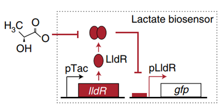
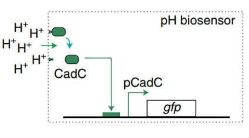
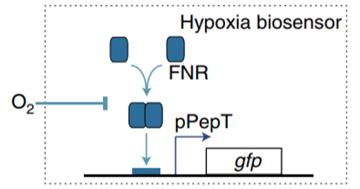

According to the WHO GLOBOCAN database, colorectal cancer (CRC) is the third most common cancer in men and the second most common cancer in women, with 1.8 million new cases and approximately 881,000 deaths worldwide in 2018[^1]. Despite the treatment of cancer, many results have been achieved, all these approaches have their challenges and limitations in the field of cancer therapy. Nonspecific toxicity to normal cells is one of the main challenges of conventional cancer therapy. In addition, some chemotherapeutic agents can lead to the formation of multidrug-resistant cells.[^2][^3]

Figure1. E. coli lactate, pH and hypoxia induce regulatory mechanisms.

Recent work has demonstrated that microorganisms injected directly intravenously can grow selectively in tumors without adverse effects on host health[^4] [^5] [^6]. Specifically, the ability of bacteria to selectively home to tumors has increased the use of microbes as therapeutic or diagnostic possibilities[^7].

In order to construct a bacterial biosensor system that can distinguish the unique organ environment, oxygen, pH and lactic acid are considered as unique indicators of colorectal cancer tumor tissue. Three operons were used to specifically recognize oxygen, pH and lactic acid. pPepT is used to sense oxygen. In the absence of oxygen, FNR binds to the $[4Fe-4S]^{2+}$ cluster to generate homologous dimers. However, in the presence of oxygen, $[4Fe-4S]^{2+}$clusters are degraded, resulting in the dissociation of FNR dimers into inactive monomers8. L-lactic acid induction is based
on lldPRD operon9.The lactic acid sensing system consists of two parts. pLldP drives the expression of interested genes. LldR repressor binds to pLldP to inhibit the expression of reporter genes, unless bound to lactic acid10,11. The pH-sensitive promoter pCadC, regulated by CadC, exhibits higher activity in acidic media than in neutral pH media.

However, many challenges limit the clinical application of current biosensor systems. In order to enable living cells to perform complex signal processing operations, amplifying genetic switches and Boolean logic gates based on serine integrase are used in the design of biosensor systems12. To give the engineered strains the therapeutic ability on tumor cells, HlyE, CCL21 and CDD-iRGD are used as therapeutic parts. HlyE is testified to able to be used as a pore-forming antitumor toxin13. CCL21 and CDD-iRGD are able to activate the immune response of host14,15. In addition, the YebF tag was added to the N-end of HlyE to realize bacterial exocrine16. Next, the tumor cell adhesion module was designed: HlpA can improve the penetration of engineered bacteria into colorectal tumor cells17. In order to export HlpA-binding protein to the surface of EcN, shortened INP tag was fused into the N-end of HlpA18,19. In the end, φX174E was put into the module, which can lead to bacteria lysis and death20,21, resulting in the release of therapeutic factors stored inside the strain22-24.

[^1]: Soleimanpour, S., Hasanian, S.M., Avan, A., Yaghoubi, A. & Khazaei, M. Bacteriotherapy in gastrointestinal
cancer. Life Sci 254, 117754 (2020). https://doi.org/10.1016/j.lfs.2020.117754
[^2]: Bray, F., et al. Global cancer statistics 2018: GLOBOCAN estimates of incidence and mortality worldwide for
36 cancers in 185 countries. CA Cancer J Clin 68, 394-424 (2018). https://doi.org/10.3322/caac.21492
[^3]: Cao, C., Yan, T.D., Black, D. & Morris, D.L. A systematic review and meta-analysis of cytoreductive surgery
with perioperative intraperitoneal chemotherapy for peritoneal carcinomatosis of colorectal origin. Ann Surg Oncol
16, 2152-2165 (2009). https://doi.org/10.1245/s10434-009-0487-4
[^4]: Forbes, N.S. Engineering the perfect (bacterial) cancer therapy. Nat Rev Cancer 10, 785-794 (2010). https://doi.org/10.1038/nrc2934
[^5]: Xiang, S., Fruehauf, J. & Li, C.J. Short hairpin RNA-expressing bacteria elicit RNA interference in mammals. Nat Biotechnol 24, 697-702 (2006). https://doi.org/10.1038/nrc2934
[^6]: Zhao, M., et al. Tumor-targeting bacterial therapy with amino acid auxotrophs of GFP-expressing Salmonella typhimurium. Proc Natl Acad Sci U S A 102, 755-760 (2005). https://doi.org/10.1073/pnas.0408422102
[^7]: Toso, J.F., et al. Phase I study of the intravenous administration of attenuated Salmonella typhimurium to patients with metastatic melanoma. J Clin Oncol 20, 142-152 (2002). https://doi.org/10.1200/jco.2002.20.1.142