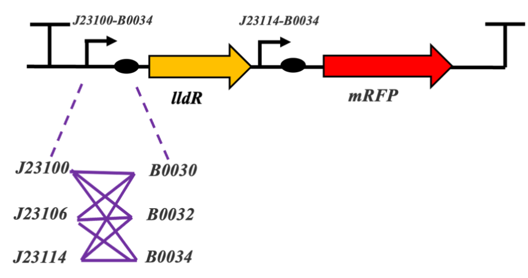
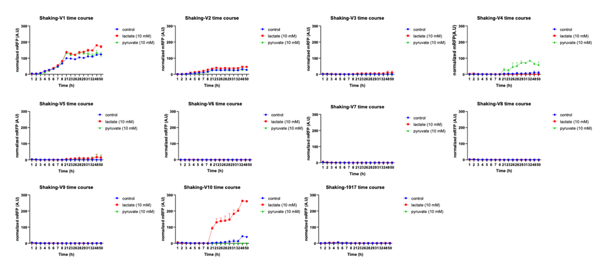
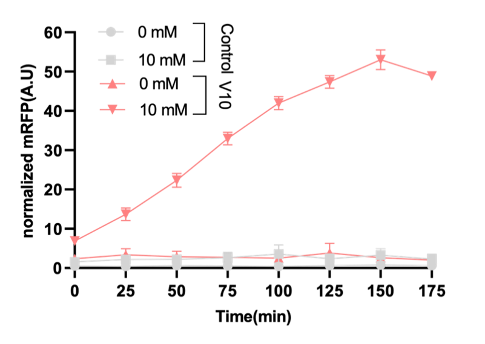
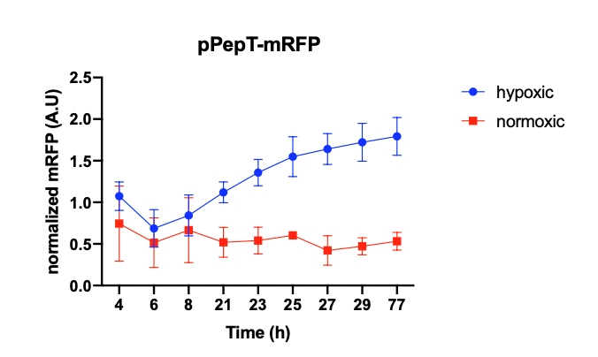
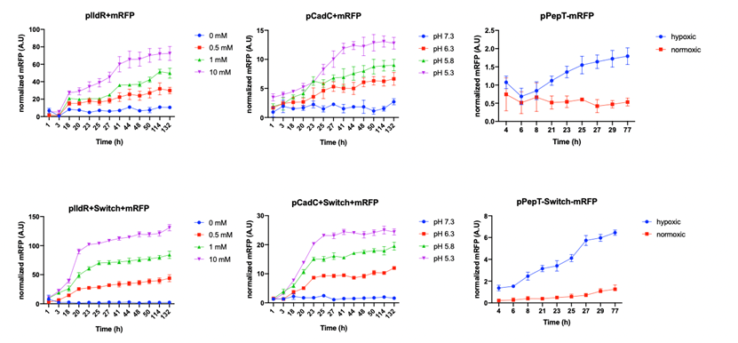
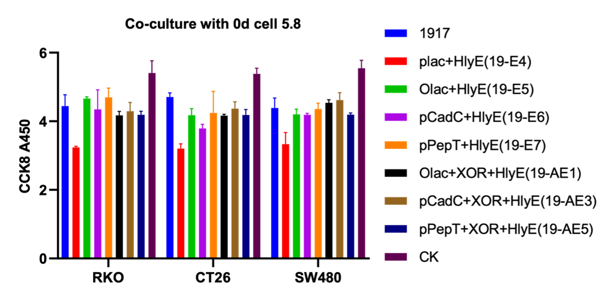
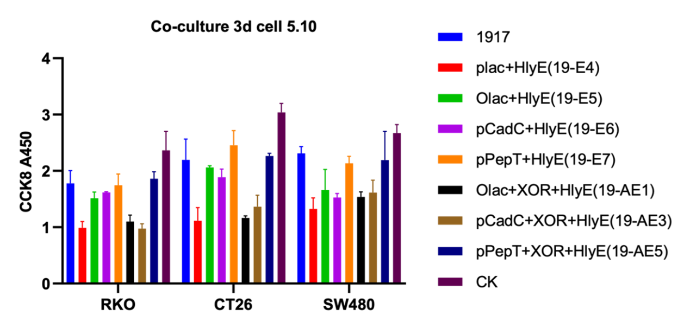
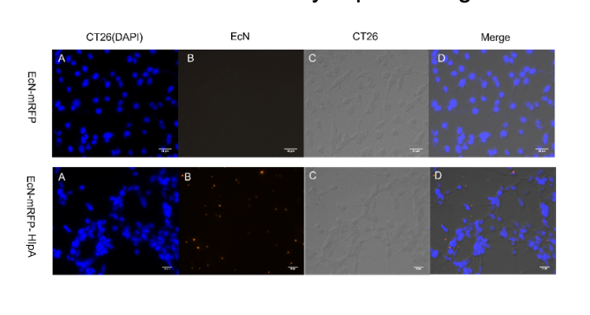
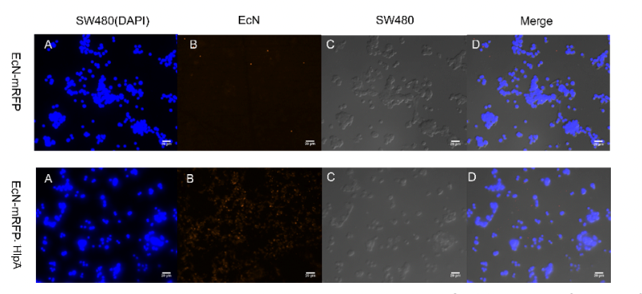
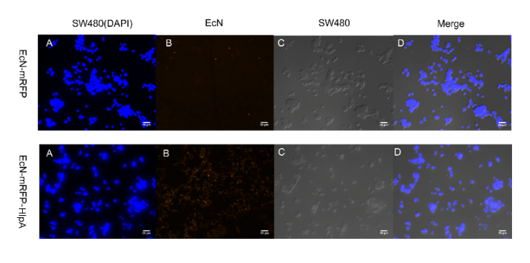

Before verifying the three promoters, we did an optimization of the lactate-induced promoter by directed evolution. Based on the above principle of lactate manipulator, we used different promoter and RBS combinations instead of lldR promoter (figure1a). The response of lactate promoter mutant strains R1_V1 to R1_V10 was characterized by the normalized fluorescence intensity of mRFP. The results showed that R1_V10, the original version with hyperspank and spoVG, had the best fold change (figure 1b). We proceeded to test the response of R1_V10 to lactate and the results showed that it can respond to 10 mM lactate levels. Among others, LB broth does not interfere with the mRFP fluorometric measurement (figure 1c).

Figure 1. Structure and experimental results of the lactate operator. Figure 1a: Combination of different promoters to optimize
the lactate operator. Figure 1b: The response of different combinations of lactate operators with the addition of 10 nM lactate,
pyruvate and equal amounts of distilled water, characterized by normalized fluorescence intensity. Figure 1c: Normalized
fluorescence intensity of R1_V10 and control group under the 10mM and 0mM lactate.

We then tested pH and hypoxia reporters, and the results not only showed that they can respond to conditions, but also indicated that E. coli Nissle 1917 is more suitable as a chassis organism compared to E. coli DH-5alpha (figure 2).

Figure 2. pH and hypoxia reporters. Left imagine: Normalized fluorescence values measured over 48 hours for a pH reporter
consisting of pCadC and mRFP. Right imagine: Normalized fluorescence values measured over 77 hours for a hypoxia reporter
consisting of pPepT and mRFP

After confirming that promoters can respond to the signal properly, we start to verify the functionality of the switch. We compared the three promoters followed by mRFP with the strains with the addition of switch under the corresponding conditions of induction. According to the results as followed, by comparison, we can conclude that the addition of the amplifying genetic switch enhances the reporting strength and robustness of the biosensor (figure 3).

Figure 3. Top row of graphs: Normalized fluorescence intensity of lactate, pH and hypoxia induced reporters (mRFP/Cell). Bottom
row of graph: Normalized fluorescence intensity (mRFP/Cell) of lactate, pH and hypoxia induced reporters after the addition of switch
(TP901 and XOR gate)

We then co-cultured the engineered microbes with murine colorectal cancer cell lines CT26, and human colorectal cancer cells RKO and SW480, this time our engineered microbes are equipped with three biosensors and switch (XOR gate) followed by HlyE, respectively. Meanwhile, there were also strains transferred to only three promoters and HlyE parts were available as controls. From the results as followed, we can draw the conclusion that OR gate can enhance promoter-induced toxicity protein levels, and engineered microbes controlled by inducible promoters express active proteins only under low lactic acid and low pH conditions (figure 5)

Figure 4. Cellular activity of engineered strains co-cultured with tumor cells at 0d and 3d
Finally, we observed microscopically the EcN introduced with INP-HlpA and mRFP compared with the control group with mRFP only, and the results showed that the adhesion of EcN to colorectal cells could be effectively improved regardless of the type of tumor cells (figure 5).

Figure 5. Adhesion of engineered microbes to tumor cells. Among them, CT26 and RKO magnify 400 times, while SW480
magnifies 300 times.